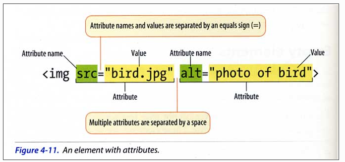

# Wed, May 31, 2023



<style>
  /* .section{
    white-space: pre-line;
  } */
</style>
<section class = "section">

## attribute
  1. noun  
    속성
  2. verb  
    1) She attributed her failure to laziness.  
    2) Her failure was attributed to laziness.
</section>

## MD know-how
### 1. br: space twice
I know your name.  
You are the one I love.

### 2. Quote: >
> this is ...  
that is  
there is  
here is  
> * nobody  
>   * anybody
>     * somebody

### 3. Block: tab twice
    #include <stdio.h>
    int main(int argc, char argv[]){

    }

### 4. Code Block: \```programming language ```

```c
#include <stdio.h>
int main(int argc, char *argv[]){
  printf("%d %s %s %s", argc, argv[0], argv[1], argv[2]);
/* 3 main00 jin 111 */
  return 0;
}
```
